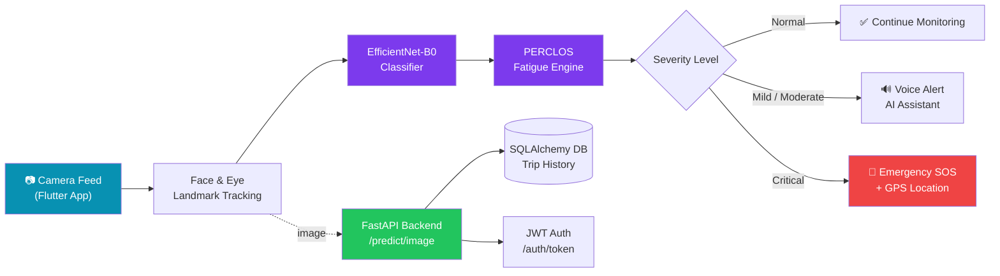

<div align="center">


### AI-Powered Driver Fatigue & Safety Detection Platform

<a href="https://sanchila-amavi.vercel.app/">
  
</a>

<br/>

[](https://www.python.org/)
[](https://pytorch.org/)
[](https://fastapi.tiangolo.com/)
[](https://flutter.dev/)
[](https://www.docker.com/)
[](LICENSE)

<br/>

[](https://github.com/SanchilaAmavi/driver-fatigue-detection/stargazers)
[](https://github.com/SanchilaAmavi/driver-fatigue-detection/network/members)
[](https://github.com/SanchilaAmavi/driver-fatigue-detection/issues)
[](https://github.com/SanchilaAmavi/driver-fatigue-detection/commits/main)

<p>
  <a href="#-overview">Overview</a> •
  <a href="#-features">Features</a> •
  <a href="#-architecture">Architecture</a> •
  <a href="#-tech-stack">Tech Stack</a> •
  <a href="#-getting-started">Getting Started</a> •
  <a href="#-api-reference">API</a> •
  <a href="#-project-structure">Structure</a> •
  <a href="#-roadmap">Roadmap</a> •
  <a href="#-author">Author</a>
</p>

</div>

<br/>

## 📌 Overview

**NexDrive** is a full-stack, software-first driver safety platform that detects fatigue and drowsiness in real time using deep learning and computer vision. It fuses a fine-tuned **EfficientNet-B0** classifier (**93.24% validation accuracy**), **PERCLOS-based eye-closure scoring**, and real-time facial landmark tracking with a **FastAPI** inference backend and a cross-platform **Flutter** mobile app - complete with voice alerts, an AI voice assistant, emergency SOS, and live GPS trip tracking.

Built to bridge the gap between an offline research model and a production-ready, deployable safety application.

<div align="center">

> 🎬 **Demo GIF / screen recording coming soon** - record a screen capture of the app (e.g. with [ScreenToGif](https://www.screentogif.com/) or `flutter screenshot`), save it as `docs/demo.gif`, then replace this block with:
> ``

</div>

<br/>

## ✨ Features

<table>
<tr>
<td width="50%" valign="top">

### 🧠 AI / Detection Engine
- **EfficientNet-B0** transfer-learning model, 4-class classifier (open eye / closed eye / yawn / no yawn)
- **93.24%** validation accuracy on CEW + Yawn datasets
- **PERCLOS** (Percentage of Eyelid Closure) fatigue scoring engine
- Real-time face & landmark tracking via OpenCV
- 4-tier severity alert system (Normal → Mild → Moderate → Critical)
- CLAHE preprocessing + Albumentations augmentation pipeline

</td>
<td width="50%" valign="top">

### 📱 Mobile & Platform
- Cross-platform **Flutter** app (Android-ready)
- Bidirectional **AI voice assistant** with wakeword detection
- Siri-style animated voice overlay & conversational memory
- Real-time voice alerts for drowsiness events
- **Emergency SOS** with live location sharing
- **GPS trip tracking** with map visualization

</td>
</tr>
<tr>
<td width="50%" valign="top">

### ⚙️ Backend / API
- **FastAPI** REST backend with JWT authentication
- `/predict/image` real-time inference endpoint
- Trip history logging via **SQLAlchemy**
- WSO2-friendly API structure for enterprise gateways
- Dockerized deployment (`docker compose up`)

</td>
<td width="50%" valign="top">

### 📊 Data & Analytics
- Trip-level fatigue analytics & history
- Session-based severity logs
- Interactive API docs via Swagger (`/docs`)
- Structured SQLite / production-ready DB layer

</td>
</tr>
</table>

<br/>

## 🏗️ Architecture



<br/>

## 🛠️ Tech Stack

<div align="center">


</div>

| Layer | Technologies |
|---|---|
| **Deep Learning** | PyTorch, EfficientNet-B0, Transfer Learning, Albumentations |
| **Computer Vision** | OpenCV, CLAHE preprocessing, Landmark tracking, PERCLOS scoring |
| **Backend** | FastAPI, SQLAlchemy, JWT Auth, Uvicorn |
| **Mobile** | Flutter, Dart, Voice Assistant (Claude API integration) |
| **DevOps** | Docker, Docker Compose |
| **Data** | CEW Dataset, Yawn Dataset, SQLite |

<br/>

## 🚀 Getting Started

### Prerequisites
- Python **3.11 or 3.12** recommended
- Flutter SDK (for the mobile app)
- Docker *(optional, for containerized deployment)*

### 1️⃣ Clone the repository
```bash
git clone https://github.com/SanchilaAmavi/driver-fatigue-detection.git
cd driver-fatigue-detection
```

### 2️⃣ Backend setup
```bash
# Create virtual environment
python -m venv venv
venv\Scripts\activate        # Windows
source venv/bin/activate     # macOS / Linux

# Install core dependencies
pip install -r requirements.txt

# Install ML dependencies (required for /predict/image)
pip install -r requirements-ml.txt

# Run the API server
uvicorn backend.app.main:app --reload
```

Open the interactive API docs at **http://127.0.0.1:8000/docs**

### 3️⃣ Run with Docker
```bash
docker compose up --build
```

### 4️⃣ Mobile app
```bash
cd mobile/flutter
flutter pub get
flutter run
```

<br/>

## 📡 API Reference

| Method | Endpoint | Description |
|---|---|---|
| `GET` | `/health` | Health check |
| `POST` | `/auth/token` | Request JWT access token |
| `GET` | `/auth/users/me` | Fetch current authenticated user profile |
| `POST` | `/predict/image` | Upload image → real-time fatigue prediction |
| `POST` | `/trips/record` | Record a completed trip's results |
| `GET` | `/trips/history` | Retrieve trip history for the current user |

<br/>

## 📁 Project Structure

```
driver-fatigue-detection/
├── backend/                 # FastAPI backend service
│   └── app/
│       ├── api/              # Route handlers
│       ├── config.py         # App configuration
│       ├── models/            # SQLAlchemy models
│       ├── services/          # ML inference & business logic
│       └── main.py           # App entry point
├── mobile/
│   └── flutter/               # Flutter mobile application
├── src/                       # Model training / experimentation
├── docs/                      # Documentation
├── tests/                     # Test automation
├── requirements.txt            # Core backend dependencies
├── requirements-ml.txt         # PyTorch / ML dependencies
├── docker-compose.yml
├── Dockerfile
└── README.md
```

<br/>

## 🗺️ Roadmap

- [x] EfficientNet-B0 fatigue classifier (93.24% accuracy)
- [x] PERCLOS-based severity scoring engine
- [x] FastAPI inference backend with JWT auth
- [x] Flutter mobile app with voice assistant
- [x] Emergency SOS + GPS trip tracking
- [x] Dockerized deployment
- [ ] WSO2 API Manager gateway integration
- [ ] WSO2 Identity Server authentication
- [ ] Expanded test automation suite
- [ ] Cloud deployment & CI/CD pipeline
- [ ] On-device (edge) inference optimization

<br/>

## 🎯 Skill Confidence

<div align="center">

**Deep Learning / PyTorch**


**Computer Vision / OpenCV**


**Backend / FastAPI**


**Mobile / Flutter**


</div>

<br/>

## 🧪 Model Performance

| Metric | Score |
|---|---|
| **Validation Accuracy** | 93.24% |
| **Classes** | Open Eye · Closed Eye · Yawn · No Yawn |
| **Datasets** | CEW, Yawn Dataset |
| **Architecture** | EfficientNet-B0 (Transfer Learning) |
| **Preprocessing** | CLAHE + Albumentations Augmentation |

<br/>

<div align="center">


<br/>


**⭐ If this project helped you, consider giving it a star!**

</div>
